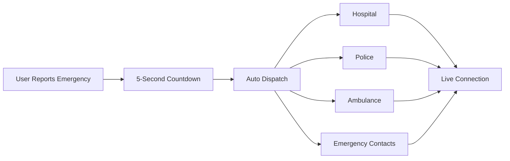

<div align="center">

# ⚡ Fast Aide

### Emergency Response System

*Connecting people with emergency services in under 5 seconds*

[](https://choosealicense.com/licenses/mit/)
[](https://reactjs.org/)
[](https://tailwindcss.com/)
[](http://makeapullrequest.com)
[]()
[]()

[🚀 Live Demo](#) · [📖 Documentation](#) · [🐛 Report Bug](https://github.com/your-org/fast-aide/issues) · [✨ Request Feature](https://github.com/your-org/fast-aide/issues)

</div>

---

## 📋 Table of Contents

- [🎯 Overview](#-overview)
- [✨ Features](#-features)
- [🛠️ Tech Stack](#️-tech-stack)
- [🎨 Screenshots](#-screenshots)
- [🚀 Quick Start](#-quick-start)
- [⚙️ Configuration](#️-configuration)
- [🔌 API Integration](#-api-integration)
- [📦 Deployment](#-deployment)
- [🤝 Contributing](#-contributing)
- [📄 License](#-license)
- [📞 Support](#-support)

---

## 🎯 Overview

**Fast Aide** is a comprehensive, real-time emergency response platform designed to save lives by connecting individuals with medical, fire, police, and disaster relief services instantly. Built with modern web technologies, it provides an intuitive interface accessible to everyone - from children to senior citizens.

### 🌟 Key Highlights

- **⚡ 5-Second Response**: Automated emergency dispatch within 5 seconds
- **🗺️ Smart Location Sharing**: Automatic GPS location transmission
- **🏥 Multi-Service Dispatch**: Simultaneous notification to all relevant services
- **📸 Evidence Upload**: Photo/video documentation support
- **🎯 Anatomical Body Map**: Interactive medical emergency reporting
- **🌐 Works Offline**: Service worker support for no-network scenarios

---

## ✨ Features

<table>
<tr>
<td width="50%">

### 🚨 Emergency Types

- 🏥 **Medical Emergency**
  - Interactive body map
  - Symptom selection
  - Severity indicators
  
- 🔥 **Fire Emergency**
  - Quick dispatch
  - Location sharing
  - Photo evidence

- 🚔 **Police/Security**
  - Instant alerts
  - Live tracking
  - Silent mode option

</td>
<td width="50%">

### 🎛️ Admin Features

- 📊 **Real-time Dashboard**
  - Active emergencies
  - Response metrics
  - System health
  
- ⚙️ **Configuration Panel**
  - API integration
  - System settings
  - User management

- 🏆 **Points System**
  - Gamification
  - Rewards
  - Recognition

</td>
</tr>
</table>

### 💎 Core Capabilities



---

## 🛠️ Tech Stack

### Frontend

<p align="left">


</p>

### Libraries & Tools

| Purpose | Technology | Version |
|---------|-----------|---------|
| UI Components | Lucide React | 0.544.0 |
| Build Tool | React Scripts | 5.0.1 |
| CSS Framework | Tailwind CSS | 3.3.0 |
| Package Manager | npm | 9.0+ |
| CSS Processing | PostCSS | 8.4+ |
| Browser Support | Autoprefixer | 10.4+ |

### Architecture

```
fast-aide/
├── 📁 public/
│   ├── index.html
│   └── manifest.json
├── 📁 src/
│   ├── App.js              # Main application
│   ├── index.js            # Entry point
│   ├── index.css           # Global styles
│   └── 📁 components/      # React components
├── 📄 package.json
├── 📄 tailwind.config.js
└── 📄 postcss.config.js
```

---

## 🚀 Quick Start

### Prerequisites

```bash
node >= 14.0.0
npm >= 6.0.0
```

### Installation

1️⃣ **Clone the repository**

```bash
git clone https://github.com/your-org/fast-aide.git
cd fast-aide
```

2️⃣ **Install dependencies**

```bash
npm install
```

3️⃣ **Start development server**

```bash
npm start
```

4️⃣ **Open your browser**

```
http://localhost:3000
```

### 🎭 Demo Accounts

| Role | Email | Password |
|------|-------|----------|
| 👤 User | `user@demo.com` | `demo` |
| 👨‍⚕️ Doctor | `doctor@demo.com` | `demo` |
| 👨‍💼 Admin | `admin@demo.com` | `demo` |

---

## ⚙️ Configuration

### Environment Variables

Create a `.env` file in the root directory:

```env
# Application
REACT_APP_NAME=Fast Aide
REACT_APP_VERSION=1.0.0

# API Endpoints
REACT_APP_HOSPITAL_API=https://api.hospital.example.com/v1
REACT_APP_POLICE_API=https://api.police.example.com/v1
REACT_APP_AMBULANCE_API=https://api.ambulance.example.com/v1
REACT_APP_MAPS_API=https://api.maps.example.com/v1

# API Keys (Keep Secret!)
REACT_APP_HOSPITAL_KEY=your_hospital_api_key
REACT_APP_MAPS_KEY=your_maps_api_key

# Features
REACT_APP_OFFLINE_MODE=true
REACT_APP_VIDEO_CALL=true
REACT_APP_EMERGENCY_TIMEOUT=5
```

### App Configuration (JSON)

```json
{
  "app": {
    "name": "Fast Aide",
    "version": "1.0.0",
    "theme": "silver",
    "emergencyTimeout": 5
  },
  "integrations": {
    "hospitalAPI": "https://api.hospital.example.com",
    "policeAPI": "https://api.police.example.com",
    "ambulanceAPI": "https://api.ambulance.example.com"
  },
  "points": {
    "quickResponse": 50,
    "successfulHelp": 100,
    "goodDeed": 75
  }
}
```

---

## 🔌 API Integration

### Hospital Management System

```javascript
const dispatchEmergency = async (emergencyData) => {
  const response = await fetch(`${HOSPITAL_API}/emergency/dispatch`, {
    method: 'POST',
    headers: {
      'Content-Type': 'application/json',
      'Authorization': `Bearer ${API_KEY}`
    },
    body: JSON.stringify({
      type: emergencyData.type,
      location: emergencyData.location,
      symptoms: emergencyData.symptoms,
      timestamp: new Date().toISOString()
    })
  });
  return response.json();
};
```

### Geolocation Service

```javascript
const getLocation = () => {
  return new Promise((resolve, reject) => {
    navigator.geolocation.getCurrentPosition(
      (position) => resolve({
        lat: position.coords.latitude,
        lng: position.coords.longitude
      }),
      reject,
      { enableHighAccuracy: true, timeout: 5000 }
    );
  });
};
```

---

## 📦 Deployment

### Build for Production

```bash
npm run build
```

### Deploy to Vercel

```bash
npm install -g vercel
vercel --prod
```

### Deploy to Netlify

```bash
npm install -g netlify-cli
netlify deploy --prod
```

### Docker Deployment

```dockerfile
FROM node:18-alpine
WORKDIR /app
COPY package*.json ./
RUN npm ci --only=production
COPY . .
RUN npm run build
EXPOSE 3000
CMD ["npm", "start"]
```

```bash
docker build -t fast-aide .
docker run -p 3000:3000 fast-aide
```

---

## 🤝 Contributing

Contributions make the open-source community amazing! Any contributions you make are **greatly appreciated**.

### Development Workflow

1. Fork the Project
2. Create your Feature Branch (`git checkout -b feature/AmazingFeature`)
3. Commit your Changes (`git commit -m 'Add some AmazingFeature'`)
4. Push to the Branch (`git push origin feature/AmazingFeature`)
5. Open a Pull Request

### Code Style

- Follow ESLint rules
- Use meaningful variable names
- Write clear comments
- Keep functions small and focused
- Test your changes

### Commit Convention

```
feat: Add new emergency type
fix: Resolve location sharing bug
docs: Update API documentation
style: Format code with Prettier
refactor: Restructure dashboard component
test: Add emergency dispatch tests
chore: Update dependencies
```

---

## 📊 Project Stats

<div align="center">


</div>

---

## 🗺️ Roadmap

- [x] Basic emergency dispatch
- [x] Body map interface
- [x] Multi-role authentication
- [x] Photo/video upload
- [ ] Real-time video calls (WebRTC)
- [ ] Offline mode (Service Workers)
- [ ] Mobile apps (React Native)
- [ ] AI symptom analysis
- [ ] Multi-language support
- [ ] Wearable device integration

---

## 📄 License

Distributed under the MIT License. See `LICENSE` for more information.

```
MIT License

Copyright (c) 2025 Fast Aide Development Team

Permission is hereby granted, free of charge, to any person obtaining a copy
of this software and associated documentation files (the "Software"), to deal
in the Software without restriction...
```

---

## 📞 Support

<div align="center">

### Need Help?

[](https://docs.fastaide.com)
[](https://discord.gg/fastaide)
[](mailto:support@fastaide.com)

</div>

### Contact Information

- 📧 Email: support@fastaide.com
- 🌐 Website: https://fastaide.com
- 💼 Enterprise: enterprise@fastaide.com
- 🐛 Bug Reports: [GitHub Issues](https://github.com/your-org/fast-aide/issues)

### Community

- [Discord Server](https://discord.gg/fastaide) - Chat with the community
- [Stack Overflow](https://stackoverflow.com/questions/tagged/fast-aide) - Ask technical questions
- [Twitter](https://twitter.com/fastaide) - Follow for updates

---

## 🙏 Acknowledgments

- [React](https://reactjs.org/) - The web framework used
- [Tailwind CSS](https://tailwindcss.com/) - For the beautiful UI
- [Lucide Icons](https://lucide.dev/) - Amazing icon library
- [Vercel](https://vercel.com/) - Deployment platform
- All our amazing contributors

---

## 👥 Authors

- **Abhishek Patel** - *Initial work* - [GitHub](https://github.com/Abhishek4411)

See also the list of [contributors](https://github.com/your-org/fast-aide/contributors) who participated in this project.

---

## 🔒 Security

If you discover a security vulnerability, please send an email to security@fastaide.com. All security vulnerabilities will be promptly addressed.

---

<div align="center">

### ⭐ Star this repository if you found it helpful!

Made with ❤️ for saving lives globally

**Fast Aide** - *Because every second counts*

[⬆ Back to Top](#-fast-aide)

</div>